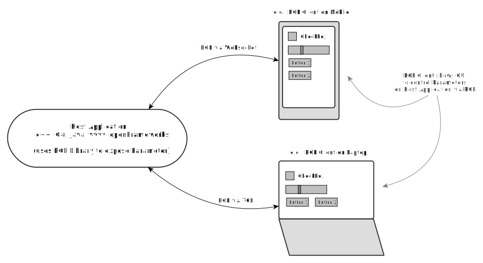

(RCP example to control a host application with other devices)

# RCP
Remote Control Protocol

A binary data-format definition to describe data values and user interface elements.
It is intended to expose parameters (values) from a host application to a client in a defined way. It was created with UI clients in mind which update values at the host application. It can also be used in a non-UI case.

[F.A.Q.](https://github.com/rabbitControl/RCP/wiki/F.A.Q.)

## RCP Levels:
- __Value__: Number, String, Color, … This is the value without visual representation
- __Widget__ (optional): Button, Slider, … This is the visual representation of a Value. A Widget must be implemented client-side. The protocol defines standard widgets for basic types. Optionally complex types can be added when needed.
- __Layout__ (optional): Placement of widgets on a screen: The Layouting of Widgets defines how widgets are placed on screen by defining standard containers.
- __Style__ (optional): Look (colors, shading, ...) of widgets on a screen: CSS styling of widgets

The first draft version of RCP only defines 1. (Values) and 2. (Widgets)

## Status

Work in progress

Request for Comments (RFC)

Join the discussion on riot:

https://riot.im/app/#/room/#rcp:matrix.org

## Endianess

The format is using big endian

## Framing

Data Framing is not scope of this protocol.

of interest. use a:
- prefix stream with magic (e.g.: 0x04 0x0F 0x05 0x09)
- SLIP RFC 1055

## Types

- string-tiny: prefixed with size [uint8] followed by [UTF-8 string-data]
- string-short: prefixed with size [uint16] followed by [UTF-8 string-data]
- string: prefixed with size [uint32] followed by [UTF-8 string-data]

## Package

| Name          | ID hex/dec   | Value           | default value   | optional   | description   |
| --------------|--------------|----------------|-----------------|------------|---------------|
| **command** | - | byte | - | n | command of package |
| timestamp | 0x11(17) | uint64 | 0 | y | optional timestamp |
| data | 0x12(18) | - | - | y | package data. type depends on command |
| **terminator** | 0 | byte | 0 | n | package terminator |

note: we may want to send id/timestamp before the data, to decide if packet is valid (udp case), prefix the value with data-id. otherwise we need to parse the data before to get id/timestamp

chaining Parameters: data can contain more than one Parameter.

### command table:

| command   | ID   | expected data | comment   |
|-----------|------|---------------|-----------|
| version | 0x01 | Version Data |
| initialize | 0x02 | null or ID Data | if no data is sent: request for all parameters. sends update command(s) to client.
| discover | 0x03 | null or ID Data | if no data is sent: request for all parameters. parameters are sent without typdedefinition-options, without value and userdata. discover only discovers on level, no subgroups are discovered. sends update command(s) to client.
| update | 0x04 |	Parameter
| remove | 0x05 | Parameter
| updatevalue | 0x06 | specialized smallest update-value format

- data provider ususally send: version, add, update, updateValue, remove
- data clients usually send: discover, initialize, update, updateValue

## ID Data

| Name          | ID hex/dec   | ValueType      | default value   | optional   | description   |
| --------------|--------------|----------------|-----------------|------------|---------------|
| **id**         | - | int16  | 0 | n | id of parameterGroup or Parameter
| **terminator** | 0 | 1 byte | 0 | n | terminator

## Version Data

| Name          | ID hex/dec   | ValueType      | default value   | optional   | description   |
| --------------|--------------|----------------|-----------------|------------|---------------|
| version       | 0x1a	(26)   | tiny-string    | "" | y | semver
| **terminator** | 0 | 1 byte | 0 | n | terminator

## Parameter:

| Name          | ID hex/dec   | ValueType      | default value   | optional   | description   |
| --------------|--------------|----------------|-----------------|------------|---------------|
| **id** | - | int16 | - | n | unique identifier (can not be 0. see: parent)
| **typedefinition** |	- | TypeDefinition | - | n | typedefinition of value
| value | 0x20 (32) | known from typedefinition | ? | y |	value (length is known by type!)
| label | 0x21 (33)	| string-tiny | "" | y | Human readable identifier
| description | 0x22 (34) | string-short | "" | y | can be shown as a tooltip
| tags | 0x23 (35)	|	string-tiny | "" | y | space separated list of tags
| order | 0x24 (36)	|	int32 | 0 | y | allows for most simple layout
| parentid | 0x25 (37)	|	int16 | 0 | y | specifies another parameterGroup as parent.
| widget | 0x26 (38) | widget data | text-input-widget | y | if not specified a default widget is used
| userdata | 0x27 (39) | size-prefixed bytearray | - | y | various user-data. e.g.: metadata, tags, ...
| userid | 0x28 (40) | string-tiny | "" | y | user id
| terminator | 0 | 1 byte | 0 | n | terminator

## ParameterGroup:

A ParameterGroup is a Parameter without value/defaultValue and a fixed TypeDefintion (group).

A ParameterGroup allows to structure your parameters and can be used to discover parameters on different levels.

A Parameter can only be child of excactly one group.

## Root Parameter Group

This parameter group is a virtual Parameter-group which does always exist.
It defines the highes level in the hirarchy tree.

The id of the root-group is 0.

No other Parameter is allowed to have this id.

## Typedefinition:

| Name          | ID hex/dec   | ValueType      | default value   | optional   | description   |
| --------------|--------------|----------------|-----------------|------------|---------------|
| **datatype** | - |  byte (see datatype table) | 0x2f | n | type of value
| ... type options... | | ||||
| **terminator** | 0 | byte | 0 | n | terminator

### Datatypes: (1byte)

| datatype   | hex (dec)   | length (bytes)   |
| -----------|-------------|------------------|
| boolean | 0x10 (16) | 1 |
| int8 | 0x11 (17) | 1 |
| uint8 | 0x12 (18) | 1 |
| int16 | 0x13	(19) | 2 |
| uint16 | 0x14 (20) | 2 |
| int32 | 0x15	(21) | 4 |
| uint32 | 0x16	(22) | 4 |
| int64 | 0x17 (23) | 8 |
| uint64 | 0x18	(24) | 8 |
| float32 | 0x19 (25) | 4 |
| float64 | 0x1a (26) | 8 |
| Vector2i32 | 0x1b | 2 x 4 |
| Vector2f32 | 0x1c | 2 x 4 |
| Vector3i32 | 0x1d | 3 x 4 |
| Vector3f32 | 0x1e | 3 x 4 |
| Vector4i32 | 0x1f | 4 x 4 |
| Vector4f32 | 0x20 | 4 x 4 |
| String | 0x21 | size prefixed
| RGB | 0x22 (34) |
| RGBA | 0x23 (35) |
| Enum | 0x24 (36) |
| fixed Array | 0x25 (37) |
| dynamic Array | 0x26 (38) |
| BANG | 0x27 (39) | 0 |
| group | 0x28 (40) | 0 |
| URI | 0x2a (42) | size prefixed
| IPv4 | 0x2b (43) | 4
| IPv6 | 0x2c (44) | 16

## Typedefinition Boolean:

byte value:
- 0 == false
- bigger than 0 == true

| Name          | ID hex/dec   | ValueType      | default value   | optional   | description   |
| --------------|--------------|----------------|-----------------|------------|---------------|
| default | 0x30 (48) | byte | 0 | y | default value

## Typedefinition Numbers: uint8, int8, uint16, int16, ...

see type-table for all number-types.

| Name          | ID hex/dec   | ValueType      | default value   | optional   | description   |
| --------------|--------------|----------------|-----------------|------------|---------------|
| default | 0x30 (48) | of type | 0 | y | default value
| minimum | 0x31 (49) | of type | 0 | y | min value
| maximum | 0x32 (50) | of type | 0 | y | max value
| multipleof | 0x33 (51) | of type | 0 | y | multiple of value
| scale | 0x34 (52) | byte | 0 | y | one of these (0x00, 0x01, 0x02)
| unit | 0x35 (53) | string-tiny | "" | y | the unit of value

## Typedefinition Vector: Vector2f32, Vector2i8, Vector4f32, ...

VectorXY

where X specifies the size

where Y specifies the type

see type-table for a full list of available Vector-types.

| Name          | ID hex/dec   | ValueType      | default value   | optional   | description   |
| --------------|--------------|----------------|-----------------|------------|---------------|
| default | 0x30 (48) | X times Y | 0 | y | default value
| minimum | 0x31 (49) | X times Y | 0 | y | min value
| maximum | 0x32 (50) | X times Y | 0 | y | max value
| multipleof | 0x33 (51) | X times Y | 0 | y | multiple of value
| scale | 0x34 (52) | byte | 0 | y | one of these (0x00, 0x01, 0x02)
| unit | 0x35 (53) | string-tiny | "" | y | the unit of value

### scale table

| Name   | hex   |
|--------|-------|
| Linear | 0x00 |
| Log | 0x01 |
| exp2 | 0x02 |

## Typedefinition String: string

4-byte size-prefixed UTF-8 string

| Name          | ID hex/dec   | ValueType      | default value   | optional   | description   |
| --------------|--------------|----------------|-----------------|------------|---------------|
| default | 0x30 (48) | rcp string | 0 - | y | default value
| regular expression | 0x31 (49) | rcp string | "" | y | regular expression to define the form. e.g. limit amount of newlines in text: "\\A(?>[^\r\n]*(?>\r\n?|\n)){0,3}[^\r\n]*\\z"

## Typedefinition Color: RGB, RGBA

Colors are in byte-order with 8-bits per channel

e.g. RGBA:

Red: 0xFF 0x00 0x00 0xFF

Green: 0x00 0xFF 0x00 0xFF

Blue: 0x00 0x00 0xFF 0xFF

| Name          | ID hex/dec   | ValueType      | default value   | optional   | description   |
| --------------|--------------|----------------|-----------------|------------|---------------|
| default | 0x30 (48) | int32 | 0 | y | default value

## Typedefinition Enum

| Name          | ID hex/dec   | ValueType      | default value   | optional   | description   |
| --------------|--------------|----------------|-----------------|------------|---------------|
| default | 0x30 (48) | uint16 | 0 | y | default value (range: 0 .. 2^16 - 1)
| entries | 0x31 (49) | uint16 (count) followed by count of string-tiny | 0 | y | list of enumerations

## Typedefinition fixed Array

| Name          | ID hex/dec   | ValueType      | default value   | optional   | description   |
| --------------|--------------|----------------|-----------------|------------|---------------|
| **elementtype** | - | TypeDefinition | StringType | n | TypeDefintion of array elements
| **length** | - | int32 | 0 | n | length of fixed array
| default | 0x30 (48) | fixed array of elementtype | - | y | default value

## Typedefinition dynamic Array

length-prefixed values of elementtype.

e.g.: \<length int32\> value value value

| Name          | ID hex/dec   | ValueType      | default value   | optional   | description   |
| --------------|--------------|----------------|-----------------|------------|---------------|
| **elementtype** | - | TypeDefinition | StringType | n | TypeDefintion of array elements
| default | 0x30 (48) | length-prefix (int32) followed by values of elementtype | 0 - | y | default value
| minimum | 0x32 | int32 | 0 | y | minimum size of array
| maximum | 0x33 | int32 | max int32 | y | maximum size of array
 

## URI:

size-prefixed UTF-8 string forming an URI

| Name          | ID hex/dec   | ValueType      | default value   | optional   | description   |
| --------------|--------------|----------------|-----------------|------------|---------------|
| default | 0x30 (48) | string | 0 - | y | default value
| filter | 0x31 (49) | string-tiny | - | y | filter as defined [here](https://msdn.microsoft.com/en-us/library/system.windows.forms.filedialog.filter(v=vs.110).aspx).
| schema | 0x32 (50) | string-tiny | - | y | space-seperated list with allowed schemas. e.g. "file ftp http https"

## IPv4:

| Name          | ID hex/dec   | ValueType      | default value   | optional   | description   |
| --------------|--------------|----------------|-----------------|------------|---------------|
| default | 0x30 (48) | 4 bytes | - | y | default value

## IPv6:

| Name          | ID hex/dec   | ValueType      | default value   | optional   | description   |
| --------------|--------------|----------------|-----------------|------------|---------------|
| default | 0x30 (48) | 16 bytes | - | y | default value

## Widget (0x24):

| Name          | ID hex/dec   | ValueType      | default value   | optional   | description   |
| --------------|--------------|----------------|-----------------|------------|---------------|
| type | 0x50 (80) | uint16 | text input | y | type of widget.  see widget type-table
| enabled | 0x51 (81) | byte | true | y | if widget allows user input
| visible | 0x52 (82) |	byte | true | y | if widget is visible
| label-visible | 0x53	(83) | byte | true | y | if label is visible
| value-visible | 0x54 (84) | byte | true | y | if value is visible
| label-position | 0x55 (85) | byte | 0 | y | see label-position table
| **terminator** | 0 | byte | 0 | n | terminator

### Widget type table:

| typename   | hex   | description
|------------|-------|--------------|
| Info | 0x09 | For discovery: only shows datatype, label. groupsParameters are collapsable
| Textbox | 0x10 |
| Numberbox | 0x11 |
| Button | 0x12 |
| Checkbox | 0x13 |
| Radiobutton | 0x14 |
| Slider | 0x15 |
| Dial | 	0x16 |
| Colorbox | 0x17 |
| Table | 0x18 |
| Treeview | 0x19 |
| Dropdown | 0x1a |
| XYField | 0x1b |

### label-position table:

| typename   | hex   |
|------------|-------|
| left | 0x00 |
| right | 0x01 |
| top | 0x02 |
| bottom | 0x03 |
| center | 0x04 |

## updateValue

to optimize the update of the value of a parameter, there is a specialized updateValue command in the form:

| Name          | ID hex/dec   | ValueType      | default value   | optional   | description   |
| --------------|--------------|----------------|-----------------|------------|---------------|
| command       | 0x06         | byte           | -               | n | updateValue command
| parameter id  |              | int16          | 0               | n | parameter id
| mandatory part of datatype   |              | byte           | 0               | n | datatype
| value         |              | type of datatype  | ?               | n | the value

this reduces the amount of data to be sent for a simple value udpate.

e.g.:

updating a int32 with id 0x01 to value 255:

0x06 0x01 0x01 0x15 0x00 0x00 0x00 0xFF (8 bytes)
